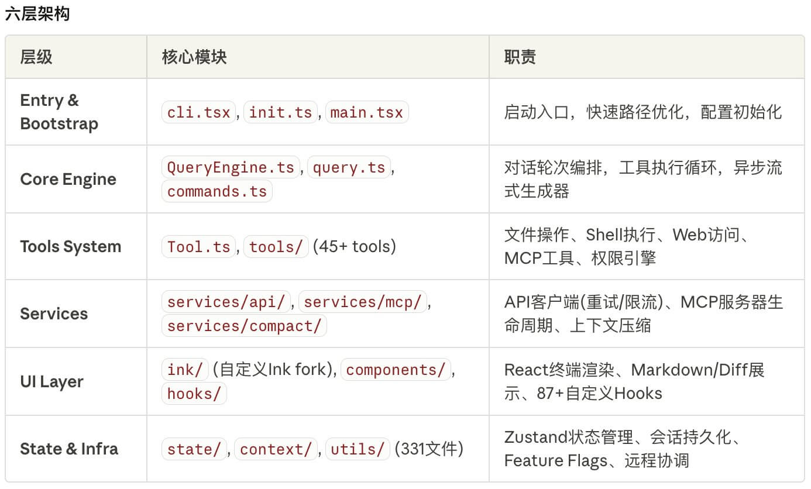

# claude code 源码

源码不能直接贴出，否则会被封

后面会逐步整理出一些基于源码的分析资料

外国小哥已经在用龙虾转成Rust了，可以去看看 [claw-code](https://github.com/instructkr/claw-code)


源码目录
```
.
├── assistant
├── bootstrap
├── bridge
├── buddy
├── cli
├── commands
├── components
├── constants
├── context
├── coordinator
├── entrypoints
├── hooks
├── ink
├── keybindings
├── memdir
├── migrations
├── moreright
├── native-ts
├── outputStyles
├── plugins
├── query
├── remote
├── schemas
├── screens
├── server
├── services
├── skills
├── state
├── tasks
├── tools
├── types
├── upstreamproxy
├── utils
├── vim
└── voice

36 directories
```

整体架构如图：




---

## 文档索引

- [`query/` 模块深度分析](./query/query模块分析.md) — 分析 query/ 目录的四个子模块：config、deps、stopHooks、tokenBudget

## Harness Engineering
- [Awesome Harness Engineering](/claude-code-ts-source/tree/main/harness-engineering)